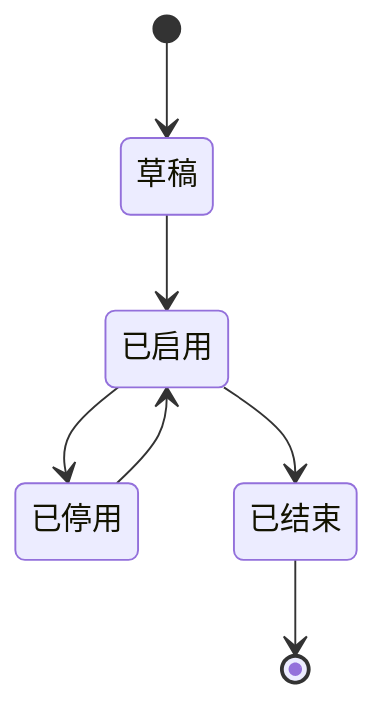

## 页面概述

运维管理员在本页维护**周期性巡检计划**：查看计划状态、启停计划，并进入详情或关联任务。园区设备增多后，计划需可配置、可追溯，而不是靠口头排期。

**页面关系**：下游 → `inspect-plan-detail`（详情）、`inspect-task-list`（关联任务）。

**场景**：示例包（有页面）——以已确认产品要求为准；下列「原型覆盖」反映演示实现程度。

## 功能范围

| 功能 | 界面入口 | 产品要求 | 原型覆盖 |
| --- | --- | --- | --- |
| 筛选计划 | 查询区 | 按计划名称、状态筛选；支持查询/重置 | 已演示 |
| 查看计划状态 | 计划列表 | 展示周期、状态等；行内启停 | 已演示 |
| 新建计划 | 「新增计划」→ 抽屉 | 校验必填后写入，列表可见新行 | 已演示 |
| 删除计划 | 行内或批量（若有） | 无未完成任务才可删；失败保留原行 | 部分演示 |
| 查看关联信息 | 行内「详情」「任务」 | 详情带计划 id；任务列表默认筛该计划 | 部分演示（任务上下文） |

## 角色与权限

| 角色 | 可见范围 | 操作权限 | 操作限制 |
| --- | --- | --- | --- |
| 管理员 | 计划列表与关联页面入口 | 查询、新建、启停、删除、查看详情与关联任务 | — |
| 执行人员 | 计划列表与关联页面入口 | 只读查看列表，经「任务」进入待办 | 无「新增计划」、无启停/删除 |

## 页面结构

| 页面分区 | 控件/内容 | 说明 |
| --- | --- | --- |
| 查询区 | 计划名称、状态、查询/重置 | 默认不限状态 |
| 工具栏 | 新增计划 | 打开创建 抽屉 |
| 列表区 | 名称、周期、状态、操作列 | 默认按更新时间倒序 |
| 新建抽屉 | 计划表单字段 | 校验必填后写入并关闭 |

| 项 | 说明 |
| --- | --- |
| 列表数据来源 | 巡检计划主数据 |
| 默认排序 | 更新时间倒序 |
| 空态 | 无匹配计划时表格空态文案，保留筛选条件 |

## 字段说明

### 表单字段

（新建 抽屉）

| 名称 | 类型 | 必填条件 | 默认 | 校验/时机 | 错误提示 | 说明 |
| --- | --- | --- | --- | --- | --- | --- |
| 计划名称 | 文本 | 创建时必填 | — | 提交时；最长 50 | 请输入计划名称 | 当前巡检计划名称 |
| 状态 | 枚举 | 创建时必填 | 草稿 | 提交时 | — | 草稿 / 已启用 / 已停用 / 已结束 |
| 执行周期 | 枚举 | 创建时必填 | 每天 | 提交时 | — | 每天 / 每周 / 每月；用于自动生成任务 |

### 筛选字段

| 名称 | 匹配方式 | 生效时机 | 重置结果 | 说明 |
| --- | --- | --- | --- | --- |
| 计划名称 | 包含匹配 | 点「查询」 | 清空该条件 | 非必填 |
| 状态 | 枚举精确 | 点「查询」 | 恢复「不限」 | 非必填 |

### 展示字段

| 名称 | 含义/口径 | 单位或格式 | 空值显示 | 说明 |
| --- | --- | --- | --- | --- |
| 计划名称 | 计划主数据名称 | 文本 | — | 来自计划主数据 |
| 执行周期 | 自动生成任务的周期 | 枚举文案 | — | — |
| 状态 | 当前计划状态 | 枚举文案 | — | 与状态流转表一致 |

## 业务规则

| 规则 ID | 规则名 | 说明 |
| --- | --- | --- |
| BR-001 | 仅启用可生成任务 | 只有已启用计划才可以生成任务。跨页引用：`inspect-plan-list/BR-001` |
| BR-002 | 已结束不可再启用 | 已结束计划不可再次启用 |
| BR-003 | 删除前无未完成任务 | 删除计划前必须不存在未完成任务；否则拦截并提示原因，列表行保持不变 |

### 状态流转

| 当前状态 | 操作 | 前置条件 | 目标状态 | 关联影响 |
| --- | --- | --- | --- | --- |
| 草稿 | 启用 | 表单校验已通过（若有） | 已启用 | 之后可按周期生成任务（BR-001） |
| 已启用 | 停用 | — | 已停用 | 待确认：是否停止对已生成未完成任务的影响、是否不再生成新任务 |
| 已停用 | 启用 | 非已结束 | 已启用 | 恢复可生成任务 |
| 已启用 | 结束 | 业务允许结束 | 已结束 | 不可再启用（BR-002） |

## 交互说明

### 进入本页

- **产品要求**：从侧栏进入「巡检计划」；按当前筛选条件加载列表。
- **原型覆盖**：已演示。
- **失败**：列表错误态 + 重试。原型覆盖：未演示（产品仍要求有错误态）。

### 筛选与刷新

- **计划名称 / 状态**：见筛选字段表；点「查询」过滤，「重置」清空并恢复默认列表。

### INT-001 新增计划

- **可操作条件**：有新建权限
- **成功结果**：打开 抽屉 空白表单
- **原型覆盖**：已演示

### INT-002 行内启用/停用

- **可操作条件**：见状态流转表；已结束不可启用
- **成功结果**：二次确认后改状态并刷新该行
- **异常反馈**：消息提示，行状态不变
- **关联影响**：停用关联影响见状态表「待确认」
- **原型覆盖**：部分演示（失败反馈尚未完整演示）
- **关联规则**：BR-001、BR-002

### INT-003 行内详情

- **可操作条件**：行存在
- **成功结果**：跳转 `inspect-plan-detail`，传递计划 id
- **原型覆盖**：已演示

### INT-004 查看任务

- **可操作条件**：行存在
- **成功结果**：跳转 `inspect-task-list`；**默认筛选该计划**
- **关联影响**：目标页默认条件=该计划；返回后是否保留本页筛选：见待确认
- **原型覆盖**：部分演示

### INT-005 删除计划

- **可操作条件**：无未完成任务（BR-003）；否则点击拦截（非仅禁用也可，须二选一并写清）
- **成功结果**：确认后删除行；若为本页最后一条则回到上一页或空态（与分页约定一致）
- **异常反馈**：消息提示，**保留原行**
- **关联影响**：关联任务侧不可再依赖该计划
- **原型覆盖**：部分演示
- **关联规则**：BR-003

### 新建抽屉

- **保存**：**产品要求**——校验必填通过后写入，关闭抽屉并刷新列表，新行可见；校验失败→字段错误、不关闭；提交失败→消息提示、保留编辑内容。**原型覆盖**：已演示（成功路径）；失败态部分演示。
- **取消 / ×**：关闭不保存。

## 验收要点

- 正常：新建计划保存后，列表首屏可见该行，状态为草稿（或表单所选状态）。
- 异常：存在未完成任务的计划不能删除；操作后提示原因，列表数据保持不变。
- 边界：已结束计划不展示可用的「启用」，或点击后说明不可启用（与 BR-002 一致）。

## 待确认事项

> **阻塞确认**：停用对任务的影响和删除拦截方式尚未确定，相关交互定稿前需完成确认。

| 问题 | 影响范围 | 备注 |
| --- | --- | --- |
| 停用计划后，是否停止生成新任务？对已生成未完成任务如何处理？ | 本页状态关联影响；任务列表 | 产品规则 |
| 从任务列表返回本页后，是否保留离开前的筛选与分页？ | 跨页 | — |
| 删除时：无未完成任务才可点（禁用）还是可点后拦截？ | 本页 INT-005 | 交互二选一 |

## 原型演示说明

- 演示数据使用 ProtoMock；数据存储与模拟交互用于原型演示，不代表正式接口实现。
- 具体功能的演示覆盖以相应说明为准。
