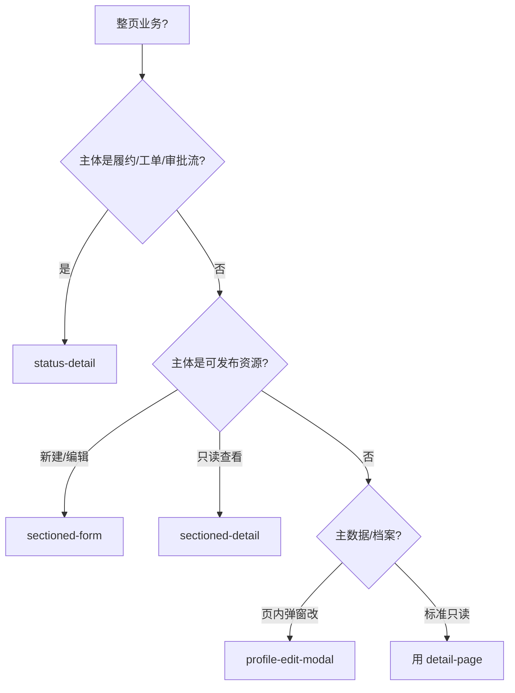

# 业务页模式（Biz Page）

整页级**组合模式**：在通用 [detail-page](../detail-page.md) / [form-page](../form-page.md) / [overlay-ui](../overlay-ui.md) 之上，沉淀中后台高频业务结构。

**不要**用本目录替代原子组件规范；先选模式，再套 `ob-*` 骨架填业务字段。

表单载体（Modal / Drawer / 整页）总选型见 [form-carrier.md](../../form-carrier.md)。

---

## 二级模式（选型）

| 模式 | 文件 | 适用 | 关键特征 |
| --- | --- | --- | --- |
| **档案弹窗编辑** | [profile-edit-modal](./profile-edit-modal.md) | 机构/企业/账号主数据 | 只读详情 + 卡头「编辑」→ **宽 Modal** 整表编辑 |
| **分区发布表单** | [sectioned-form](./sectioned-form.md) | 商品/策略/配置发布 | 页头操作 + **步骤条** + 多卡分区表单 + 协议/底栏提交 |
| **分区镜像详情** | [sectioned-detail](./sectioned-detail.md) | 与上表单成对的只读页 | 顶栏状态 + **与表单同名分区** + 条件「编辑」 |
| **状态机详情** | [status-detail](./status-detail.md) | 订单/工单/审批履约 | 多卡叠放 + **状态→顶栏操作** + 材料块 + 全程日志表 |

```
biz-page/
├── profile-edit-modal   档案只读 + 宽弹窗编辑
├── sectioned-form       分区/分步整页发布
├── sectioned-detail     与表单镜像的只读详情
└── status-detail        状态驱动履约/工单详情
```

---

## 选型决策



| 判断 | 选 |
| --- | --- |
| 字段少、不想跳编辑页 | profile-edit-modal |
| 字段多、有审核/上架链路 | sectioned-form + sectioned-detail 成对 |
| 操作随状态变、有材料/日志 | status-detail |
| 普通 CRUD 详情 | 直接 [detail-page](../detail-page.md) |

---

## 与通用组件关系

| 通用 | 模式中的用法 |
| --- | --- |
| [chrome](../chrome.md) | 工作台壳层 |
| [detail-page](../detail-page.md) | `.ob-desc`、分块卡、步骤条 |
| [form-page](../form-page.md) | `.ob-form-grid-2`、`.ob-footer-bar`、校验态 |
| [overlay-ui](../overlay-ui.md) | `.ob-modal--wide` / 确认框；材料查看弹窗 |
| [data-table](../data-table.md) | 全程日志、明细子表 |
| [list-page](../list-page.md) | 列表「详情/编辑」入口 |

---

## proto-spec 约定

| 模式 | Spec 侧重 |
| --- | --- |
| profile-edit-modal | fields 区分「主数据只读」与「可编辑」；interaction 写编辑/保存/证照 |
| sectioned-form | flow 步骤；fields 按分区；草稿 vs 提交校验 |
| sectioned-detail | 分区与表单镜像；顶栏编辑显隐规则 |
| status-detail | **状态机表**（状态 → 操作 / 材料可见 / 日志节点）；禁止散落 if |

---

## Agent 阅读

1. 本文件选型  
2. 打开对应二级 md + 依赖的通用 components  
3. 按骨架复制 HTML，替换业务文案  
4. 宽 Modal / 双列表单用 kit：`.ob-modal--wide`、`.ob-form-grid-2`  
5. 可点样例：`examples/proto-spec-demo/pages/inspect-plan-detail.html`（档案弹窗编辑）
