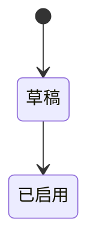

# flow.md 模板（仅兼容旧包）

> **新 Spec**：有业务状态变化时，在扁平 md 内写 **状态转换表**（必填）；Mermaid 流程图/状态图 **可选**。见 [spec-template.md](./spec-template.md)。  
> 本文仅用于仍单独维护 `flow.md` 的旧四分册包。

## 结构

```md
# 业务流程


# 状态机



# 关键节点

| 节点 | 说明 |
| --- | --- |
| … | … |

# 异常分支

| 异常 | 处理 |
| --- | --- |
| … | … |
```

## 约束（旧包）

1. 旧 `flow.md` 建议至少含一个 Mermaid（流程或状态机）；复杂页可两者都要。**新扁平 Spec 不强制 Mermaid。**
2. 节点名与页面状态文案、字段枚举 **一致**。
3. 有状态变化时，除图外须有「当前状态 → 操作 → 前置条件 → 目标状态 → 关联影响」表（新页写在主 Spec 内）。
4. 「关键节点」「异常分支」用表格，避免长标题堆叠。
5. Mermaid 语法保持简单；失败时 Runtime 会回退源码，但仍须可渲染。
